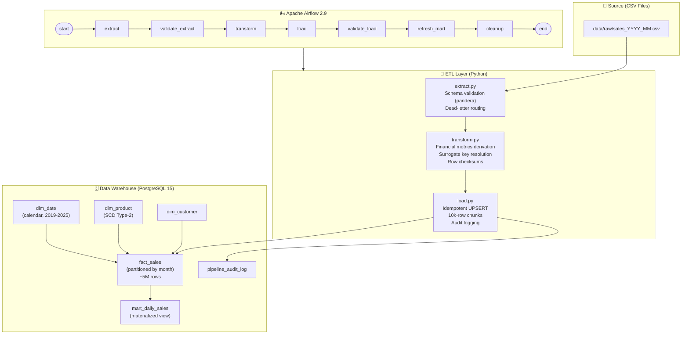

# 🛒 E-commerce Sales Performance Data Pipeline


A **production-grade, end-to-end ETL pipeline** for analysing 5 years of e-commerce transactions
using dimensional modeling, Apache Airflow orchestration, and PostgreSQL.

---

## Architecture



---

## Project Structure

```
ecommerce_pipeline/
├── docker-compose.yml          # Full Airflow + PostgreSQL stack
├── Dockerfile                  # Custom Airflow image
├── requirements.txt
├── .env.example
├── init_db.py                  # Schema bootstrap (non-Docker dev)
│
├── sql/
│   ├── 01_create_schema.sql    # Star schema + partitions + audit table
│   ├── 02_seed_dim_date.sql    # Calendar dimension (2019-2025)
│   └── init_pg.sh              # Postgres container init script
│
├── etl/
│   ├── generate_data.py        # 5M+ row synthetic generator
│   ├── extract.py              # CSV → validated DataFrame
│   ├── transform.py            # Cleanse → derive → resolve keys
│   ├── load.py                 # Idempotent UPSERT to PostgreSQL
│   └── utils/
│       ├── db.py               # SQLAlchemy pool
│       ├── logger.py           # Structured JSON logger
│       └── metrics.py          # Checksums + audit writer
│
├── dags/
│   ├── sales_pipeline.py       # Daily DAG (main pipeline)
│   └── backfill_dag.py         # On-demand historical backfill
│
├── data/
│   ├── raw/                    # Generated CSVs (git-ignored)
│   └── dead_letter/            # Rejected rows with error annotations
│
└── tests/
    ├── conftest.py             # Shared fixtures
    ├── test_transform.py       # 15 unit tests
    ├── test_load.py            # 8 integration tests (SQLite)
    ├── test_dag.py             # 12 DAG integrity tests
    └── test_data_quality.py    # 14 data quality tests
```

---

## 📊 Streamlit Dashboard

An interactive showcase dashboard is included for demos and LinkedIn:

```bash
streamlit run dashboard/app.py
# → Opens at http://localhost:8501
```

**4 pages:**
| Page | Content |
|------|---------|
| 📊 Overview | KPI metrics, revenue trend, category breakdown, top 10 products |
| 📈 Revenue Analytics | Monthly heatmap, YoY comparison, category area chart, SQL samples |
| 🗂️ Pipeline Health | 30-run audit log, SLA duration chart, test results |
| 🏗️ Architecture | Airflow DAG flow, star schema diagram, innovation highlights |

## Quick Start

### Prerequisites
- Docker Desktop ≥ 4.x
- Docker Compose v2

### 1. Clone & configure

```bash
git clone <repo-url> ecommerce_pipeline
cd ecommerce_pipeline
cp .env.example .env
# Edit .env and set your AIRFLOW__CORE__FERNET_KEY (see .env.example for instructions)
```

### 2. Generate synthetic data

```bash
pip install -r requirements.txt
python -m etl.generate_data --start 2020-01-01 --end 2024-12-31
# → Writes ~60 CSV files to data/raw/ (~5M rows total, ~2-5 min)
```

### 3. Start the stack

```bash
docker compose up -d
```

Wait ~60 seconds for Airflow to initialise, then open:

| Service | URL | Credentials |
|---------|-----|-------------|
| Airflow UI | http://localhost:8080 | airflow / airflow |
| PostgreSQL | localhost:5432 | pipeline / pipeline |

### 4. Run the pipeline

**Via Airflow UI**: Enable `sales_etl` DAG → trigger manually  
**Via CLI**:
```bash
docker compose exec airflow-scheduler \
  airflow dags trigger sales_etl --exec-date 2024-01-01
```

### 5. Run the full test suite (no Docker needed)

```bash
pip install -r requirements.txt
pytest tests/ -v --tb=short --ignore=tests/test_dag.py
# Include DAG tests only if airflow is installed:
pytest tests/ -v --tb=short
```

---

## Airflow DAG: `sales_etl`

```
start → extract → validate_extract → transform → load → validate_load → refresh_mart → cleanup → end
```

| Task | Retries | Timeout | Notes |
|------|---------|---------|-------|
| `extract` | 3 | 30 min | Reads CSV, pandera validation |
| `validate_extract` | 0 | 5 min | Row count + uniqueness checks |
| `transform` | 3 | 45 min | Derives metrics, resolves keys |
| `load` | 3 | 30 min | Chunked UPSERT (10k rows/chunk) |
| `validate_load` | 0 | 10 min | SUM(net_amount) parity check |
| `refresh_mart` | 1 | 15 min | REFRESH MATERIALIZED VIEW |
| `cleanup` | 0 | 5 min | Removes temp Parquet files |

SLA for full run: **2 hours**  
`cleanup` uses `trigger_rule="all_done"` so temp files are removed even on failure.

---

## Dimensional Model

```
                    ┌─────────────┐
                    │  dim_date   │
                    │ date_key PK │
                    └──────┬──────┘
                           │
┌──────────────┐    ┌──────▼──────────────────┐    ┌───────────────┐
│  dim_product │    │       fact_sales         │    │  dim_customer │
│ product_sk PK├────┤ sale_sk + sale_date PK   ├────┤ customer_sk PK│
│ SCD Type-2   │    │ Partitioned by month     │    │               │
│ margin_pct   │    │ row_checksum (SHA-256)   │    │               │
└──────────────┘    │ pipeline_run_id          │    └───────────────┘
                    └──────────────────────────┘
```

**Key design decisions:**
- `fact_sales` is **range-partitioned by `sale_date`** (one partition per month) for efficient date-range queries and partition pruning
- `UPSERT` uses `WHERE fact_sales.row_checksum != EXCLUDED.row_checksum` — rows are only written if they actually changed
- `dim_product` is SCD Type-2 with `valid_from / valid_to` columns for historical price tracking

---

## Analytics Queries (Samples)

```sql
-- Top 10 products by revenue (last 90 days)
SELECT dp.product_name, dp.category,
       SUM(fs.net_amount)  AS revenue,
       SUM(fs.quantity)    AS units_sold
FROM   fact_sales   fs
JOIN   dim_product  dp ON dp.product_sk = fs.product_sk
WHERE  fs.sale_date >= CURRENT_DATE - 90
  AND  fs.return_flag = FALSE
GROUP  BY 1, 2
ORDER  BY revenue DESC
LIMIT  10;

-- Daily revenue trend (materialized mart)
SELECT full_date, category, SUM(revenue) AS daily_revenue
FROM   mart_daily_sales
WHERE  full_date >= '2024-01-01'
GROUP  BY full_date, category
ORDER  BY full_date;

-- Pipeline health check
SELECT run_date, stage, status, rows_processed,
       duration_secs, source_checksum IS NOT NULL AS checksummed
FROM   pipeline_audit_log
ORDER  BY started_at DESC
LIMIT  20;
```

---

## Backfill

```bash
docker compose exec airflow-scheduler \
  airflow dags trigger sales_etl_backfill \
  --conf '{"start":"2020-01-01","end":"2022-12-31","data_dir":"data/raw"}'
```

---

## Error Handling

| Scenario | Behaviour |
|----------|-----------|
| Invalid CSV row | Quarantined to `data/dead_letter/` with `_error` annotation |
| DB connection drop | SQLAlchemy reconnects via `pool_pre_ping`; Airflow retries task |
| Transform rule violation | Row dropped + counted in audit log `rows_rejected` |
| Load failure mid-chunk | Full transaction rolled back; no partial writes |
| Sum divergence >0.1% | `validate_load` raises `AssertionError`; DAG fails |
| Audit log write failure | Non-fatal; logged to stderr; pipeline continues |

---

## Testing

```bash
# All tests excluding DAG (no airflow install needed)
pytest tests/ -v --ignore=tests/test_dag.py

# With coverage report
pytest tests/ -v --cov=etl --cov-report=term-missing --ignore=tests/test_dag.py

# Full suite (requires airflow installed)
pytest tests/ -v
```

| Test File | Tests | Coverage Area |
|-----------|-------|---------------|
| `test_transform.py` | 15 | Financial math, dtype normalisation, checksums |
| `test_load.py` | 8 | Idempotency, UPSERT, validate_load gate |
| `test_dag.py` | 12 | Task count, dependencies, retry config |
| `test_data_quality.py` | 14 | Invariants, referential integrity, variance guard |

---

## Monitoring

- **Airflow UI** → DAG runs, task logs, SLA misses
- **`pipeline_audit_log`** → per-task metrics: rows, duration, checksums
- **dead_letter directory** → file count indicates schema drift or upstream issues

---

## Innovation Highlights

| Feature | Details |
|---------|---------|
| **Dead-letter routing** | Invalid rows are quarantined (not silently dropped) with error annotation |
| **Checksum-gated UPSERT** | Rows only written if `row_checksum` changed — zero spurious I/O on re-runs |
| **Pandera schema contracts** | Schema violations surface immediately at extract, not silently downstream |
| **Contextvar logging** | `run_id`, `task_id`, `dag_id` are injected into every log line for correlation |
| **Materialized view mart** | `mart_daily_sales` is refreshed `CONCURRENTLY` — no query downtime |
| **Monthly partitioning** | Queries against recent data prune 90%+ of partitions automatically |
| **SCD Type-2 products** | Historical price changes tracked without losing past sale accuracy |
