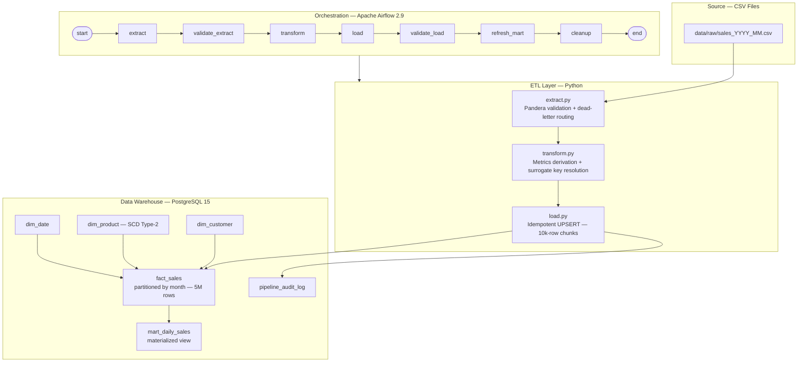

# E-commerce Sales Performance Data Pipeline


End-to-end ETL pipeline that processes 5 years of e-commerce transactions (~5M rows) using a star schema in PostgreSQL, orchestrated daily with Apache Airflow, and fully containerised with Docker.

---

## How it works



---

## Project Structure

```
ecommerce_pipeline/
├── docker-compose.yml          # Full Airflow + PostgreSQL stack
├── Dockerfile                  # Custom Airflow image
├── requirements.txt
├── .env.example
├── init_db.py                  # Schema bootstrap (without Docker)
│
├── sql/
│   ├── 01_create_schema.sql    # Star schema + partitions + audit table
│   ├── 02_seed_dim_date.sql    # Calendar dimension (2019-2025)
│   └── init_pg.sh              # Postgres init script
│
├── etl/
│   ├── generate_data.py        # Synthetic data generator (~5M rows)
│   ├── extract.py              # CSV → validated DataFrame
│   ├── transform.py            # Cleanse → derive metrics → resolve keys
│   ├── load.py                 # Idempotent UPSERT to PostgreSQL
│   └── utils/
│       ├── db.py               # SQLAlchemy connection pool
│       ├── logger.py           # Structured JSON logger
│       └── metrics.py          # Checksums + audit writer
│
├── dags/
│   ├── sales_pipeline.py       # Daily DAG (main pipeline)
│   └── backfill_dag.py         # Historical backfill DAG
│
├── dashboard/
│   └── app.py                  # Streamlit dashboard
│
├── data/
│   ├── raw/                    # Generated CSVs (git-ignored)
│   └── dead_letter/            # Rejected rows with error annotations
│
└── tests/
    ├── conftest.py             # Shared fixtures
    ├── test_transform.py       # Unit tests
    ├── test_load.py            # Integration tests (SQLite)
    ├── test_dag.py             # DAG integrity tests
    └── test_data_quality.py    # Data quality tests
```

---

## Quick Start

**Prerequisites:** Docker Desktop ≥ 4.x, Docker Compose v2

### 1. Clone and configure

```bash
git clone <repo-url> ecommerce_pipeline
cd ecommerce_pipeline
cp .env.example .env
# Edit .env — set AIRFLOW__CORE__FERNET_KEY (instructions are in .env.example)
```

### 2. Generate data

```bash
pip install -r requirements.txt
python -m etl.generate_data --start 2020-01-01 --end 2024-12-31
# Writes ~60 CSV files to data/raw/ (~5M rows, takes 2-5 min)
```

### 3. Start the stack

```bash
docker compose up -d
```

Give it ~60 seconds to initialise, then open:

| Service | URL | Credentials |
|---------|-----|-------------|
| Airflow UI | http://localhost:8080 | airflow / airflow |
| PostgreSQL | localhost:5432 | pipeline / pipeline |

### 4. Trigger the pipeline

Via UI: enable the `sales_etl` DAG and trigger it manually.

Via CLI:
```bash
docker compose exec airflow-scheduler \
  airflow dags trigger sales_etl --exec-date 2024-01-01
```

### 5. Run tests (no Docker needed)

```bash
pytest tests/ -v --ignore=tests/test_dag.py

# With coverage
pytest tests/ -v --cov=etl --cov-report=term-missing --ignore=tests/test_dag.py

# Full suite (requires Airflow installed)
pytest tests/ -v
```

### 6. Dashboard

```bash
streamlit run dashboard/app.py
# Opens at http://localhost:8501
```

---

## Airflow DAG

```
start → extract → validate_extract → transform → load → validate_load → refresh_mart → cleanup → end
```

| Task | Retries | Timeout | Notes |
|------|---------|---------|-------|
| `extract` | 3 | 30 min | CSV read + Pandera validation |
| `validate_extract` | 0 | 5 min | Row count + uniqueness checks |
| `transform` | 3 | 45 min | Metrics derivation + surrogate key resolution |
| `load` | 3 | 30 min | Chunked UPSERT (10k rows/chunk) |
| `validate_load` | 0 | 10 min | SUM(net_amount) parity check (0.1% tolerance) |
| `refresh_mart` | 1 | 15 min | REFRESH MATERIALIZED VIEW CONCURRENTLY |
| `cleanup` | 0 | 5 min | Removes temp Parquet staging files |

SLA: **2 hours** for a full daily run. The `cleanup` task uses `trigger_rule="all_done"` so staging files are cleared even if something upstream fails.

---

## Data Model

```
                    ┌─────────────┐
                    │  dim_date   │
                    │ date_key PK │
                    └──────┬──────┘
                           │
┌──────────────┐    ┌──────▼──────────────────┐    ┌───────────────┐
│  dim_product │    │       fact_sales         │    │  dim_customer │
│ product_sk PK├────┤ sale_sk + sale_date PK   ├────┤ customer_sk PK│
│ SCD Type-2   │    │ Partitioned by month     │    │               │
│ margin_pct   │    │ row_checksum (SHA-256)   │    │               │
└──────────────┘    │ pipeline_run_id          │    └───────────────┘
                    └──────────────────────────┘
```

- `fact_sales` is range-partitioned by month — date-range queries skip 90%+ of partitions automatically
- UPSERT uses `WHERE row_checksum != EXCLUDED.row_checksum` — re-running on the same data is a no-op
- `dim_product` is SCD Type-2 with `valid_from / valid_to` to track price changes without rewriting history

---

## Sample Queries

```sql
-- Top 10 products by revenue (last 90 days)
SELECT dp.product_name, dp.category,
       SUM(fs.net_amount)  AS revenue,
       SUM(fs.quantity)    AS units_sold
FROM   fact_sales   fs
JOIN   dim_product  dp ON dp.product_sk = fs.product_sk
WHERE  fs.sale_date >= CURRENT_DATE - 90
  AND  fs.return_flag = FALSE
GROUP  BY 1, 2
ORDER  BY revenue DESC
LIMIT  10;

-- Daily revenue from the materialized mart
SELECT full_date, category, SUM(revenue) AS daily_revenue
FROM   mart_daily_sales
WHERE  full_date >= '2024-01-01'
GROUP  BY full_date, category
ORDER  BY full_date;

-- Pipeline run history
SELECT run_date, stage, status, rows_processed,
       duration_secs, source_checksum IS NOT NULL AS checksummed
FROM   pipeline_audit_log
ORDER  BY started_at DESC
LIMIT  20;
```

---

## Backfill

```bash
docker compose exec airflow-scheduler \
  airflow dags trigger sales_etl_backfill \
  --conf '{"start":"2020-01-01","end":"2022-12-31","data_dir":"data/raw"}'
```

---

## Error Handling

| Scenario | What happens |
|----------|-------------|
| Invalid CSV row | Quarantined to `data/dead_letter/` with `_error` annotation — never silently dropped |
| DB connection drop | SQLAlchemy reconnects via `pool_pre_ping`; Airflow retries the task |
| Transform rule violation | Row dropped and counted in `rows_rejected` in the audit log |
| Load failure mid-chunk | Full transaction rolled back — no partial writes |
| Sum divergence > 0.1% | `validate_load` raises `AssertionError` and the DAG fails |
| Audit log write failure | Non-fatal — logged to stderr, pipeline continues |

---

## Testing

49 tests, 2.33 seconds.

| File | Tests | What it covers |
|------|-------|----------------|
| `test_transform.py` | 15 | Financial math, dtype normalisation, row checksums |
| `test_load.py` | 8 | Idempotency, UPSERT behaviour, validate_load gate |
| `test_dag.py` | 12 | Task count, dependency order, retry config |
| `test_data_quality.py` | 14 | Invariants, referential integrity, variance guard |

---

## Monitoring

- **Airflow UI** — DAG run history, task logs, SLA misses
- **`pipeline_audit_log`** — per-task row counts, durations, and checksums
- **`data/dead_letter/`** — any files here mean bad rows reached the extract stage; worth investigating

---

## Design Decisions

| Decision | Why |
|----------|-----|
| Checksum-gated UPSERT | Rows only written if `row_checksum` changed — zero I/O on re-runs |
| Pandera schema contracts | Schema violations caught at the extract boundary, not three steps later in the warehouse |
| Dead-letter routing | Rejected rows are annotated and quarantined, not just counted |
| ContextVar logging | Every log line carries `run_id`, `task_id`, `dag_id` for distributed trace correlation |
| Concurrent mart refresh | `REFRESH MATERIALIZED VIEW CONCURRENTLY` — no read downtime during refresh |
| Monthly partitioning | PostgreSQL prunes partitions aggressively on date-range queries |
| SCD Type-2 products | Price changes tracked over time without corrupting historical revenue figures |
